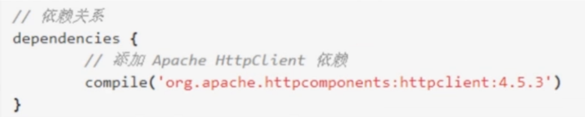
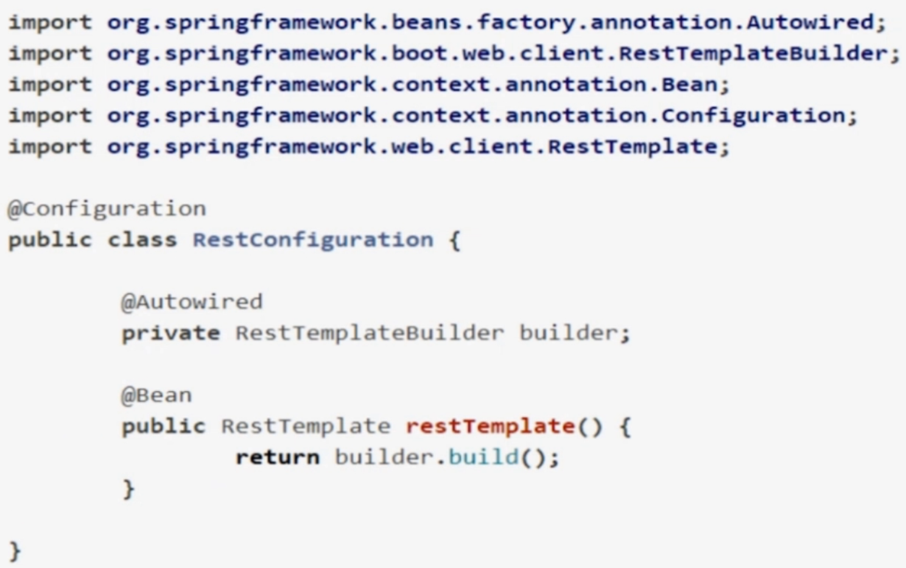
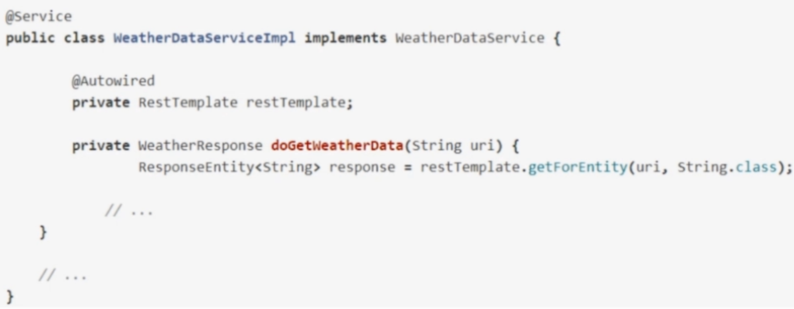
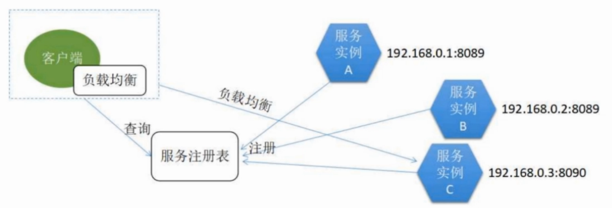
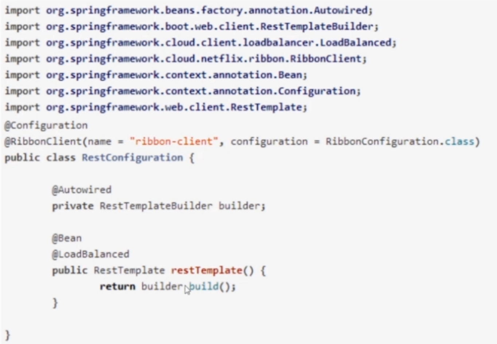
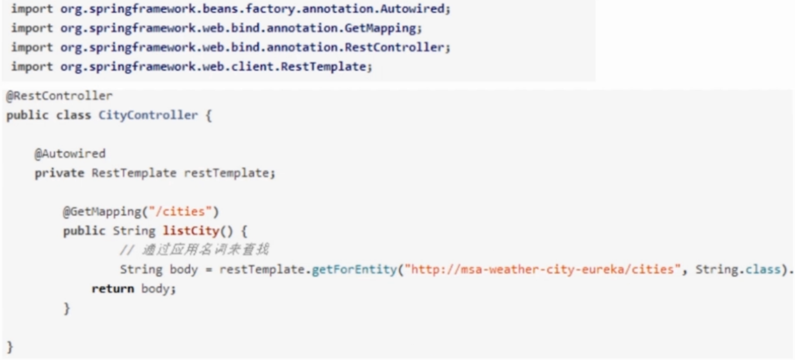
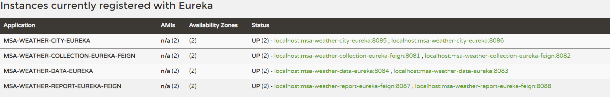
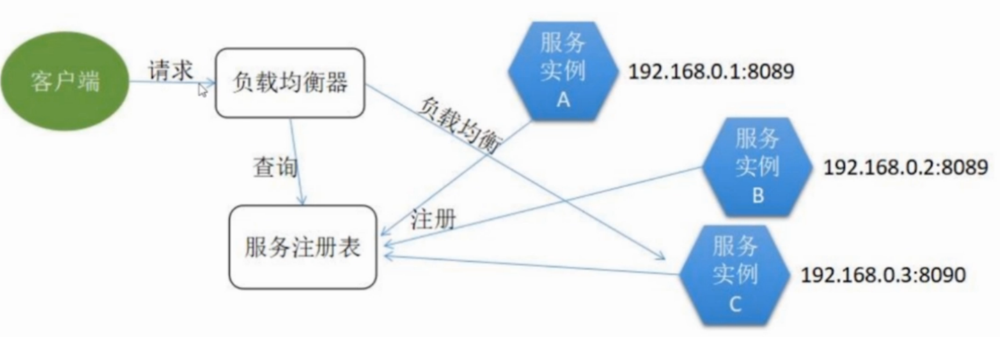
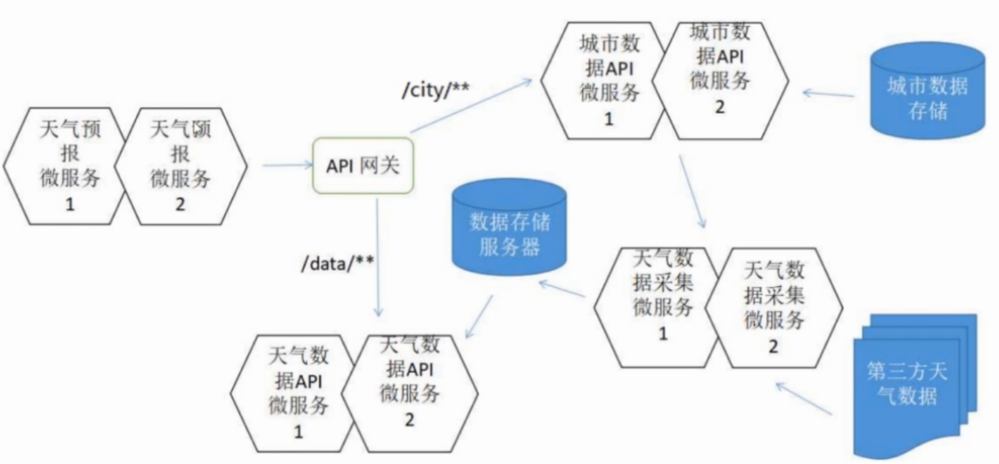
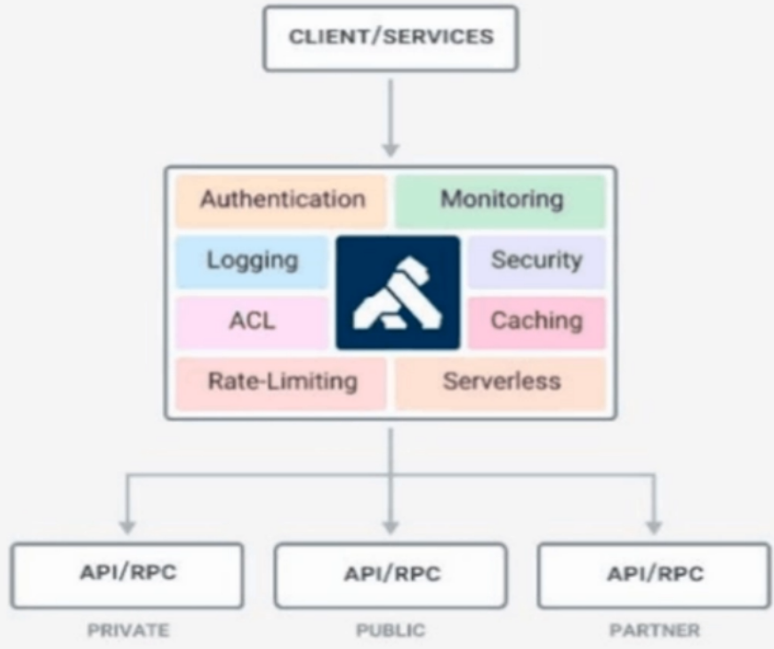

# Weather Forcast System
## Environment
+ JDK 8
+ Gradle 4
+ Redis 3.2.100
+ Apache HttpClient 4.5.3 (Request thrird party API to get weather info)
+ Spring Boot Web Starter
+ Spring Boot Data Redis Starter
+ Quartz Scheduler
+ Spring Boot Thymeleaf Starter 2.0.0.M4
+ Thymeleaf 3.0.7.RELEASE
+ Bootstrap 4.0.0
# 1. Basic Weather Forcast System 
`micro-weather-basic`
1. Get weather info by cityId (http://wthrcdn.etouch.cn/weather_mini?citykey=101010100)
```
GET localhost:8080/weather/cityId/101010100
```
```
{
    "data": {
        "city": "北京",
        "aqi": null,
        "ganmao": "各项气象条件适宜，发生感冒机率较低。但请避免长期处于空调房间中，以防感冒。",
        "wendu": "20",
        "yesterday": {
            "date": "22日星期三",
            "high": "高温 35℃",
            "low": "低温 17℃",
            "fl": "<![CDATA[3-4级]]>",
            "fx": "西南风",
            "type": "晴"
        },
        "forecast": [
            {
                "date": "23日星期四",
                "high": "高温 35℃",
                "fengli": "<![CDATA[3-4级]]>",
                "low": "低温 17℃",
                "fengxiang": "西南风",
                "type": "晴"
            },
            {
                "date": "24日星期五",
                "high": "高温 37℃",
                "fengli": "<![CDATA[<3级]]>",
                "low": "低温 21℃",
                "fengxiang": "南风",
                "type": "晴"
            },
            {
                "date": "25日星期六",
                "high": "高温 35℃",
                "fengli": "<![CDATA[3-4级]]>",
                "low": "低温 21℃",
                "fengxiang": "南风",
                "type": "多云"
            },
            {
                "date": "26日星期天",
                "high": "高温 35℃",
                "fengli": "<![CDATA[<3级]]>",
                "low": "低温 22℃",
                "fengxiang": "南风",
                "type": "多云"
            },
            {
                "date": "27日星期一",
                "high": "高温 24℃",
                "fengli": "<![CDATA[3-4级]]>",
                "low": "低温 17℃",
                "fengxiang": "北风",
                "type": "小雨"
            }
        ]
    },
    "status": 1000,
    "desc": "OK"
}
```
2. Get weather info by cityName (http://wthrcdn.etouch.cn/weather_mini?city=深圳)
```
GET localhost:8080/weather/cityName/深圳
```
```
{
    "data": {
        "city": "深圳",
        "aqi": null,
        "ganmao": "天气转凉，空气湿度较大，较易发生感冒，体质较弱的朋友请注意适当防护。",
        "wendu": "25",
        "yesterday": {
            "date": "22日星期三",
            "high": "高温 29℃",
            "low": "低温 23℃",
            "fl": "<![CDATA[<3级]]>",
            "fx": "无持续风向",
            "type": "小雨"
        },
        "forecast": [
            {
                "date": "23日星期四",
                "high": "高温 29℃",
                "fengli": "<![CDATA[<3级]]>",
                "low": "低温 23℃",
                "fengxiang": "无持续风向",
                "type": "小雨"
            },
            {
                "date": "24日星期五",
                "high": "高温 28℃",
                "fengli": "<![CDATA[<3级]]>",
                "low": "低温 24℃",
                "fengxiang": "无持续风向",
                "type": "中雨"
            },
            {
                "date": "25日星期六",
                "high": "高温 29℃",
                "fengli": "<![CDATA[<3级]]>",
                "low": "低温 25℃",
                "fengxiang": "无持续风向",
                "type": "大到暴雨"
            },
            {
                "date": "26日星期天",
                "high": "高温 30℃",
                "fengli": "<![CDATA[<3级]]>",
                "low": "低温 25℃",
                "fengxiang": "无持续风向",
                "type": "阵雨"
            },
            {
                "date": "27日星期一",
                "high": "高温 31℃",
                "fengli": "<![CDATA[<3级]]>",
                "low": "低温 26℃",
                "fengxiang": "无持续风向",
                "type": "阵雨"
            }
        ]
    },
    "status": 1000,
    "desc": "OK"
}
```
# 2. 使用Redis来提升Weather forcast service app的并发访问能力
`micro-weather-redis`
前提：Weather forcast service app 能实现简单的天气查询
## 为什么使用Redis （目前的系统存在以下问题）
1. app作为relay的中介，用户调用中介，中介调用上游API，可能产生延时delay
2. 上游第三方API有调用次数和频率的限制，也有有承接调用能力的限制，对上游API调用次数过多，使得API的负载过大
+ Redis是基于内存的缓存系统，响应速度快，可以解决以上两个问题
## 原因有两个：
1. 减轻访问上游API带来的延时问题，确保及时响应
2. 减少（上游api的）服务调用，减轻天气接口的负担，提高并发访问量
+ 天气不需要实时更新，定时更新数据即可（例如半小时更新一次），这种场景非常适合应用Redis缓存

# 3.quartz scheduler 定时获取天气数据
`micro-weather-quartz`
Every 1800 seconds | 30 mins, synchronize weather data(excute WeatherDataServiceImpl on cities in CityList.xml) once.

# 4.Combine with thymeleaf-frontend
`micro-weather-report`
## API
Get weather info by cityId: http://localhost:8080/report/cityId/101280501
```
GET /report/cityId/{cityId}
```
# 至此，micro-weather-report 就是一个完整的springboot项目
`micro-weather-all-in-one`
# 微服务
## 单块架构的优缺点
->请求
用户 表示层 业务层 数据访问层 数据库
<-响应
### 优点
+ 功能划分清楚
+ 层次关系良好
+ 每一层独立
+ 部署简单
+ 技术单一
+ 用人成本低
### 缺点
+ 功能仍然太大：数据同步，缓存，UI
+ 升级风险高：升级其中一个服务，不得不要升级整个系统
+ 维护成本增加：不是一个人来维护，一个人无法handle和理解代码
+ 交付周期变长：四个功能全完成，才能交付，不能单个交付
+ 可伸缩性差： 本来只要扩展数据采集一个功能的，但是因为是一个整体，就不得不把所有功能都扩展
+ 监控困难：进程、IO 不能再细粒度了
因为有这些缺点，所以单体架构转向发展微服务架构
## 如何将单块架构转为微服务架构
soa：系统功能打散，一个功能对应一个微服务
SOA (Service Oriented Architecture)
+ Service provider: public its service and give response to the request
+ Service broker: register the published services, classify them and provide search engine
+ Service consumer: find requested service from service broker and utilize the service

APP可以拆分为以下的服务：城市数据 天气数据 数据同步 天气数据预报
## 微服务架构的设计原则
+ 拆分足够微
+ 轻量级通信
+ 领域驱动原则：
帮助团队理清数据的边界，搞清上下文 不同的领域： 城市数据采集、天气数据采集，数据同步，
+ 单一职责原则
+ DevOps及两个披萨
+ 不限于技术栈
## 怎么设计微服务系统
+ 服务拆分
+ 服务注册： 服务注册中心（表），服务启动，则在中心注册，广播状态
+ 服务发现：调用服务的接口获取名称
+ 服务消费：服务调用的称为消费者，被调用的服务称为供应商
+ 统一入口
+ 配置管理
+ 熔断机制：高并发无法响应请求，熔断部分服务，避免整个系统崩溃
+ 自动扩展：当overload出现，10个服务扩展到20个，比较复杂
### DDD 拆分服务
#### 天气数据采集 msa-weather-collection-server
数据采集、数据存储
数据采集微服务在天气数据同步任务中，依赖于城市数据API微服务
#### 天气数据API msa-weather-data-server
数据查询
```
GET /weather/cityId/{cityId}
GET /weather/cityName/{cityName}
```
#### 天气预报 msa-weather-report-server
数据展示
```
GET /report/cityId/{cityId}
```
天气预报微服务查询天气信息，依赖于天气数据API微服务
天气预报微服务提供的城市列表，依赖于城市数据API微服务
#### 城市数据API msa-weahter-city-server
数据查询
```
GET /cities
```
#### 存在三个TODO
数据采集微服务在天气数据同步任务中，依赖于城市数据API微服务
天气预报微服务查询天气信息，依赖于天气数据API微服务
天气预报微服务提供的城市列表，依赖于城市数据API微服务
#### Storage 存储设计
Redis（NoSQL） XML

# 服务注册和发现
## 使用Eureka
+ 服务注册和发现机制
+ 和Spring Cloud 无缝集成
+ 高可用性
+ 开源
## Steps
一个eureka micro-service client的模板：`micro-weather-eureka-client`
```
msa-weather-collection-server -> msa-weather-collection-eureka
msa-weather-data-server -> msa-weather-data-eureka
msa-weather-city-server -> msa-weather-city-eureka
msa-weather-report-server -> msa-weather-report-eureka
```
## Configuration-server and start app on port 8761
Server is : `micro-weather-eureka-server`
@EnableEurekaServer in `app.java`
server.port: 8761
## Start-Client
```
msa-weather-collection-server -> msa-weather-collection-eureka  //port=8081, 8082
msa-weather-data-server -> msa-weather-data-eureka //port=8083, 8084
msa-weather-city-server -> msa-weather-city-eureka //port=8085, 8086
msa-weather-report-server -> msa-weather-report-eureka //port=8087, 8088
```
Start 4 eureka client in 4 different port:
```
//Remember to start Redis first!
F:\webProject\springcloud\msa-weather-collection-eureka>gradle wrapper build
F:\webProject\springcloud\msa-weather-collection-eureka>cd build/libs
F:\webProject\springcloud\msa-weather-collection-eureka\build\libs>java -jar msa-weather-collection-eureka-1.0.0.jar --server.port=8081
F:\webProject\springcloud\msa-weather-collection-eureka\build\libs>java -jar msa-weather-collection-eureka-1.0.0.jar --server.port=8082

F:\>cd F:\webProject\springcloud\msa-weather-data-eureka
F:\webProject\springcloud\msa-weather-data-eureka>gradle wrapper build
F:\webProject\springcloud\msa-weather-data-eureka>cd build/libs
F:\webProject\springcloud\msa-weather-data-eureka\build\libs>java -jar msa-weather-data-eureka-1.0.0.jar --server.port=8083
F:\webProject\springcloud\msa-weather-data-eureka\build\libs>java -jar msa-weather-data-eureka-1.0.0.jar --server.port=8084

F:\webProject\springcloud\msa-weather-city-eureka>gradle wrapper build
F:\webProject\springcloud\msa-weather-city-eureka>cd build/libs
F:\webProject\springcloud\msa-weather-city-eureka\build\libs>java -jar msa-weather-city-eureka-1.0.0.jar --server.port=8085
F:\webProject\springcloud\msa-weather-city-eureka\build\libs>java -jar msa-weather-city-eureka-1.0.0.jar --server.port=8086

F:\webProject\springcloud\msa-weather-report-eureka>gradle wrapper build
F:\webProject\springcloud\msa-weather-report-eureka>cd build/libs
F:\webProject\springcloud\msa-weather-report-eureka\build\libs>java -jar msa-weather-report-eureka-1.0.0.jar --server.port=8087
F:\webProject\springcloud\msa-weather-report-eureka\build\libs>java -jar msa-weather-report-eureka-1.0.0.jar --server.port=8088
```
# 微服务的消费模式 consumer
SOA (Service Oriented Architecture)
+ Service provider: public its service and give response to the request
+ Service broker: register the published services, classify them and provide search engine
+ Service consumer: find requested service from service broker and utilize the service

## 1. 服务直连模式
### 特点
+ 简洁明了，只要传入一个url，就能获取资源
+ 平台语言无关性，http的特点，不需要框架和技术来实现，
+ 无法保证服务的可用性，一旦ip地址宕机，就无法用到资源
+ 生产环境中比较少用
### Example: Apache HttpClient
#### Dependency

#### Injection

#### Usage

## 2. 客户端发现模式
### Steps
+ 服务实例启动后，将自己的位置信息提交到服务注册表
+ 客户端从服务注册表进行查询，来获取可用的服务实例
+ 客户端自行使用负载均衡算法从多个服务实例中选择出一个
### Implement availabity for the service
将我们需要访问的服务（比如，“micro-weather-eureka-client”），启动为多个示例。当客户端需要访问“micro-weather-eureka-client”时，会自行去选择其中任意一个服务实例来访问，这样，即便其中的某个服务实例不可用，也不会影响整个服务功能。
这样就实现了服务的高可用。
### Diagram

### Client side lb Example 1: Ribbon
HTTP & TCP, use with eureka, 有很多负载均衡的算法<br>
Ribbon 是一个客户端负载平衡器，它可以很好地控制HTTP和TCP客户端的行为。 Feign 已经使用 Ribbon，所以如果你使用@FeignClient，就已经启用了客户端负载均衡功能。
Ribbon 的一个中心概念就是命名客户端（named clien）。 每个负载平衡器都是组合的组件的一部分，它们一起工作以根据需要联系远程服务器，并且集合具有您将其作为应用程序开发人员（例如使用@FeignClient注解）的名称。 Spring Cloud使用RibbonClientConfiguration为每个命名的客户端根据需要创建一个新的集合作为ApplicationContext。 这包含（其中包括）一个ILoadBalancer，一个RestClient和一个ServerListFilter。
#### Dependency
```
<dependency>
    <groupId>org.springframework.cloud</groupId>
    <artifactId>spring-cloud-starter-netflix-ribbon</artifactId>
</dependency>
```
#### Injection

#### Usage

### Client side lb Example 2: Feign
```
micro-weather-eureka-client -> micro-weahter-eureka-client-feign
```
#### 在我们的四个天气微服务中，有三个`TODO`项：

- 数据采集微服务(collection)在天气数据同步任务中，依赖于城市数据API微服务city
- 天气预报微服务(report)查询天气信息，依赖于天气数据API微服务data
- 天气预报微服务(report)提供的城市列表，依赖于城市数据API微服务city

那么我们可以看出来，需要去集成Feign去消费的微服务只有两个：`msa-weather-collection-eureka`和`msa-weather-report-eureka`。我们将其改造为：`msa-weather-collection-eureka-feign`和`msa-weather-report-eureka-feign`.
```
msa-weather-colleciton-eureka -> msa-weather-collection-eureka-feign
msa-weather-data-eureka
msa-weather-city-eureka
msa-weather-report-eureka -> msa-weather-report-eureka-feign
```
#### Run feign intergration with eureka micro service
```
F:\webProject\springcloud\micro-weather-eureka-server\build\libs>java -jar micro-weather-eureka-server-1.0.0.jar --server.port=8761
F:\webProject\springcloud\msa-weather-collection-eureka-feign\build\libs>java -jar msa-weather-collection-eureka-feign-1.0.0.jar --server.port=8081
F:\webProject\springcloud\msa-weather-collection-eureka-feign\build\libs>java -jar msa-weather-collection-eureka-feign-1.0.0.jar --server.port=8082
F:\webProject\springcloud\msa-weather-data-eureka\build\libs>java -jar msa-weather-data-eureka-1.0.0.jar --server.port=8083
F:\webProject\springcloud\msa-weather-data-eureka\build\libs>java -jar msa-weather-data-eureka-1.0.0.jar --server.port=8084
F:\webProject\springcloud\msa-weather-city-eureka\build\libs>java -jar msa-weather-city-eureka-1.0.0.jar --server.port=8085
F:\webProject\springcloud\msa-weather-city-eureka\build\libs>java -jar msa-weather-city-eureka-1.0.0.jar --server.port=8086
F:\webProject\springcloud\msa-weather-report-eureka-feign\build\libs>java -jar msa-weather-report-eureka-feign-1.0.0.jar --server.port=8087
F:\webProject\springcloud\msa-weather-report-eureka-feign\build\libs>java -jar msa-weather-report-eureka-feign-1.0.0.jar --server.port=8088
```
See the web application in `http://localhost:8088/report/cityId/101280209`.
See load balancer console result in `localhost:8761`:

#### Dependency
#### Injection
#### Usage
## 3. 服务端发现模式
load balancer 处于服务端，从多个服务实例中选择出一个实例
### Diagram


# API 网关
## 好处
+ 避免将内部信息泄露给外部
+ 为微服务添加额外的安全层
+ 支持混合通信协议
+ 降低构建微服务的复杂性，从代码层隔离功能项，使得码工更专注于核心业务
+ 微服务模拟与虚拟化，虚拟的API，设计上的要求，做集成测试
## 坏处
+ 在架构上需要额外考虑更多的编排与管理，那些micro service放在哪些API中
+ 路由逻辑配置要进行统一的管理
+ 可能引发单点故障，API网关作为单一入口，高并发场景下，一旦宕机，会导致所有micro service不可用
## API的常见实现方式
### Nginx
高性能 稳定 低消耗资源 高并发能力

### Spring Cloud Zuul
提供了认证、鉴权、限流、动态路由、监控、弹性、安全、负载均衡、协助单点压测、静态响应等边缘服务的框架
#### Zuul Intergration
+ micro-weather-eureka-client -> micro-weather-eureka-client-zuul
+ 配置写法
```
spring.application.name: micro-weather-eureka-client-zuul
eureka.client.serviceUrl.defaultZone: http://localhost:8761/eureka/
zuul.routes.hi.path: /hi/**
zuul.routes.hi.serviceId: micro-weather-eureka-client
```
+ Port
java -jar micro-weather-eureka-client-1.0.0.jar --server.port=8081
Zuul port:8080
+ valid url
http://localhost:8081/hello
http://localhost:8080/hi/hello
#### Zuul Intergration in weather app
```
micro-weather-eureka-server //eureka server on port 8761
msa-weather-collection-eureka-feign 
msa-weather-data-eureka
msa-weather-city-eureka
msa-weather-report-eureka-feign -> msa-weather-report-eureka-feign-gateway
新增的zuul api：msa-weather-eureka-client-zuul
```
把report对于data API和city API的依赖修改为依赖Zuul API网关

API gateway 会把对city url的请求route转发到城市数据API微服务上，API gateway也会把对data url的请求route转发到天气数据API微服务上
+ 配置写法
```
spring.application.name: msa-weather-eureka-client-zuul
eureka.client.serviceUrl.defaultZone: http://localhost:8761/eureka/

zuul.routes.city.path: /city/**
zuul.routes.city.serviceId: msa-weather-city-eureka

zuul.routes.data.path: /data/**
zuul.routes.data.serviceId: msa-weather-data-eureka
```
+ How to run
```
//Remember to start Redis first!
// Run eureka server on port 8761 
F:\webProject\springcloud\micro-weather-eureka-server\build\libs>java -jar micro-weather-eureka-server-1.0.0.jar --server.port=8761

F:\webProject\springcloud\msa-weather-collection-eureka-feign\build\libs>java -jar msa-weather-collection-eureka-feign-1.0.0.jar --server.port=8081
F:\webProject\springcloud\msa-weather-collection-eureka-feign\build\libs>java -jar msa-weather-collection-eureka-feign-1.0.0.jar --server.port=8082
F:\webProject\springcloud\msa-weather-data-eureka\build\libs>java -jar msa-weather-data-eureka-1.0.0.jar --server.port=8083
F:\webProject\springcloud\msa-weather-data-eureka\build\libs>java -jar msa-weather-data-eureka-1.0.0.jar --server.port=8084
F:\webProject\springcloud\msa-weather-city-eureka\build\libs>java -jar msa-weather-city-eureka-1.0.0.jar --server.port=8085
F:\webProject\springcloud\msa-weather-city-eureka\build\libs>java -jar msa-weather-city-eureka-1.0.0.jar --server.port=8086
F:\webProject\springcloud\msa-weather-report-eureka-feign-gateway\build\libs>java -jar msa-weather-report-eureka-feign-gateway-1.0.0.jar --server.port=8087
F:\webProject\springcloud\msa-weather-report-eureka-feign-gateway\build\libs>java -jar msa-weather-report-eureka-feign-gateway-1.0.0.jar --server.port=8088
F:\webProject\springcloud\msa-weather-eureka-client-zuul\build\libs>java -jar msa-weather-eureka-client-zuul-1.0.0.jar server.port=8089
```
浏览器访问http://localhost:8087/report/cityId/101280601 和 http://localhost:8088/report/cityId/101280601 可以正常使用天气预报app。
### Kong
API网关的管理平台 底层也是nginx，提供一些插件，例如验证、日志、调用频率限制



