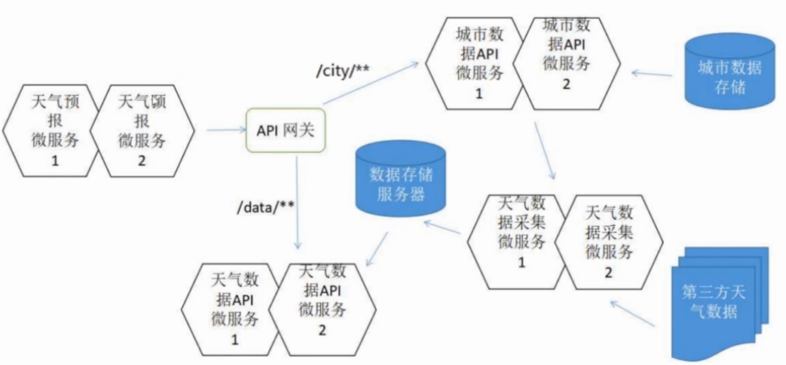

# 天气预报 msa-weather-report-eureka-feign-gateway
Report micro-service API via zuul api gateway：msa-weather-eureka-client-zuul
## Implement 微服务的熔断机制
msa-weather-report-eureka-feign-gateway->msa-weather-report-eureka-feign-gateway-hystrix
## Environment
+ JDK 8
+ Gradle 4
+ Spring Boot Web Starter
+ Thymeleaf 3.0.7.RELEASE
+ Bootstrap 4.0.0-bata.2
+ Spring Cloud Starter Netflix Eureka Client Finchley.M2
+ Spring Cloud Starter OpenFeign Finchley.M2
+ hystrix
```
micro-weather-eureka-server //eureka server on port 8761
msa-weather-collection-eureka-feign 
msa-weather-data-eureka
msa-weather-city-eureka
msa-weather-report-eureka-feign -> msa-weather-report-eureka-feign-gateway
新增的zuul api：msa-weather-eureka-client-zuul
```
把report对于data API和city API的依赖修改为依赖Zuul API网关

API gateway 会把对city url的请求route转发到城市数据API微服务上，API gateway也会把对data url的请求route转发到天气数据API微服务上
## 配置写法
```
spring.application.name: msa-weather-eureka-client-zuul
eureka.client.serviceUrl.defaultZone: http://localhost:8761/eureka/

zuul.routes.city.path: /city/**
zuul.routes.city.serviceId: msa-weather-city-eureka

zuul.routes.data.path: /data/**
zuul.routes.data.serviceId: msa-weather-data-eureka
```
## How to run
```
//Remember to start Redis first!
// Run eureka server on port 8761 
F:\webProject\springcloud\micro-weather-eureka-server\build\libs>java -jar micro-weather-eureka-server-1.0.0.jar --server.port=8761

F:\webProject\springcloud\msa-weather-collection-eureka-feign\build\libs>java -jar msa-weather-collection-eureka-feign-1.0.0.jar --server.port=8081
F:\webProject\springcloud\msa-weather-collection-eureka-feign\build\libs>java -jar msa-weather-collection-eureka-feign-1.0.0.jar --server.port=8082
F:\webProject\springcloud\msa-weather-data-eureka\build\libs>java -jar msa-weather-data-eureka-1.0.0.jar --server.port=8083
F:\webProject\springcloud\msa-weather-data-eureka\build\libs>java -jar msa-weather-data-eureka-1.0.0.jar --server.port=8084
F:\webProject\springcloud\msa-weather-city-eureka\build\libs>java -jar msa-weather-city-eureka-1.0.0.jar --server.port=8085
F:\webProject\springcloud\msa-weather-city-eureka\build\libs>java -jar msa-weather-city-eureka-1.0.0.jar --server.port=8086
F:\webProject\springcloud\msa-weather-report-eureka-feign-gateway-hystrix\build\libs>java -jar msa-weather-report-eureka-feign-gateway-hystrix-1.0.0.jar --server.port=8087
F:\webProject\springcloud\msa-weather-report-eureka-feign-gateway-hystrix\build\libs>java -jar msa-weather-report-eureka-feign-gateway-hystrix-1.0.0.jar --server.port=8088
F:\webProject\springcloud\msa-weather-eureka-client-zuul\build\libs>java -jar msa-weather-eureka-client-zuul-1.0.0.jar server.port=8089
```
浏览器访问http://localhost:8087/report/cityId/101280601 和 http://localhost:8088/report/cityId/101280601 可以正常使用天气预报app
## (out of date) build package and run micro service as client
On port 8087 and port 8088
```
//Remember to start Redis first!
F:\webProject\springcloud\msa-weather-report-eureka>gradle wrapper build
F:\webProject\springcloud\msa-weather-report-eureka>cd build/libs
F:\webProject\springcloud\msa-weather-report-eureka\build\libs>java -jar msa-weather-report-eureka-1.0.0.jar --server.port=8087
F:\webProject\springcloud\msa-weather-report-eureka\build\libs>java -jar msa-weather-report-eureka-1.0.0.jar --server.port=8088
```
## (out of date) API
Get weather info by cityId: http://localhost:8080/report/cityId/101280501
```
GET /report/cityId/{cityId}
```